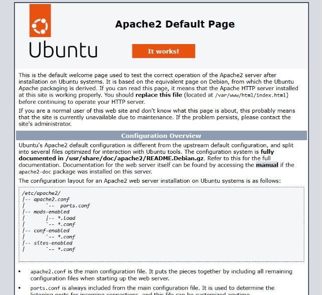
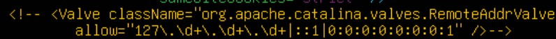
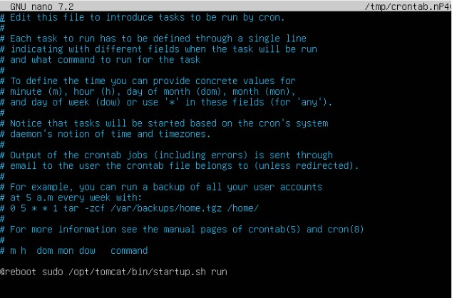
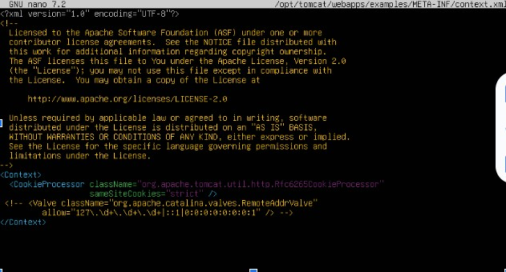
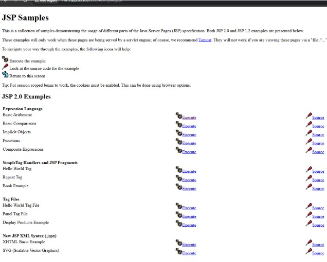
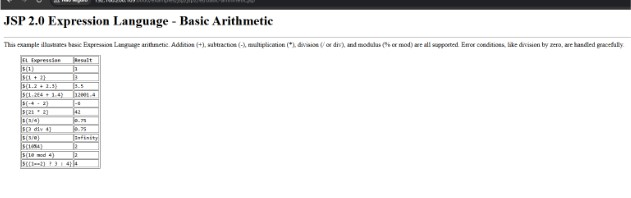
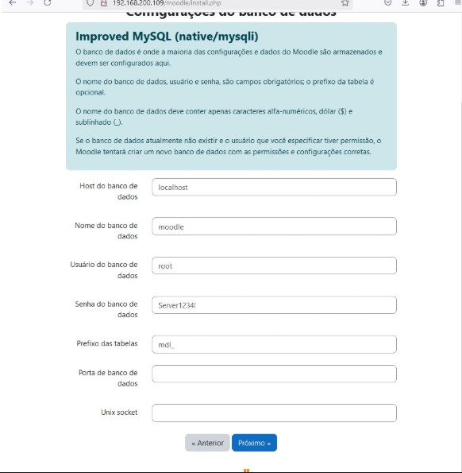
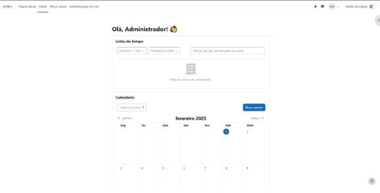
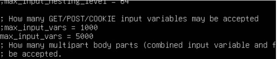
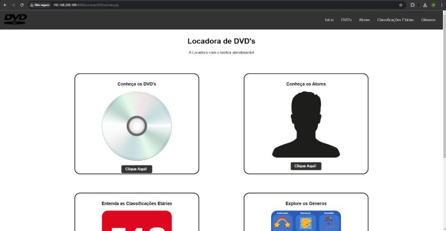

# 🌐☕ ServidorWeb-UbuntoServer

## 💻 Criando Máquina Virtual

- Nome da máquina: `<insira-nome-do-servidor>`
- Imagem ISO: [LINK PARA ISO](https://ubuntu.com/download/server)
- RAM utilizada: recomendado ao menos 2GB
- Disco Rígido: Ao menos 25GB
- Processador: recomendado ao menos 2 CPU's
- Configure a rede para ‘Bridge Adapter’ ao invés de ‘NAT’.

## 💿 Instalação do Ubuntu Server

Prossiga com a instalação normalmente e configure o login e senha.
- Usuário:
  - `<insira-nome-de-usuário>`
- Senha utilizada:
  - `<insira-senha>`
- Nome do server utilizado:
  - `<insira-nome-do-servidor>`

## 🛠 Instalações e Configurações Básicas

### SSH:
- Instalar:
  - `sudo apt install openssh-server -y`
- Acessar servidor:
  - `ssh <usuário>@<ip do servidor>`

### MYSQL:
- Instalar:
  - `sudo apt install mysql-server -y`
- Configurar segurança:
  - `sudo mysql_secure_installation`
  - Selecione a opção de segurança que você deseja utilizar
  - digite ‘y’ para todas as opções oferecidas
- Configuração de senha e privilégios:
  - `sudo mysql`
  - `ALTER USER ‘root’@’localhost’ IDENTIFIED WITH mysql_native_password BY ‘<sua senha>’;`
  - `FLUSH PRIVILEGES;`
  - `EXIT;`
  - Verifique se a senha foi inserida com sucesso tentando acessar com `sudo mysql -u root -p`

### APACHE:
- Instalar:
  - `sudo apt install apache2 php libapache2-mod-php -y`
  - Verifique se a instalação ocorreu com sucesso tentando acessar o servidor por outra máquina, para isso apenas entre com o endereço ip da máquina do servidor no local do endereço do site em um navegador, como: http://`<ip-do-servidor>`
  - Essa página deve ser exibida:
  - 

## 🐱‍👤 Instalando e Configurando Tomcat

- Instalar o jdk:
  - `sudo apt install default-jdk -y`
- Crie o usuário tomcat:
  - `sudo groupadd tomcat`
  - `sudo useradd -s /bin/false -g tomcat -d /opt/tomcat tomcat`
- Instalar o tomcat:
  - `cd /tmp`
  - `curl -O https://dlcdn.apache.org/tomcat/tomcat-9/v9.0.98/bin/apache-tomcat-9.0.98.tar.gz` (Caso não encontre, insira o link da versão mais recente disponível)
- Configure as permissões:
  - `sudo mkdir /opt/tomcat`
  - `cd /opt/tomcat`
  - `sudo tar xzvf /tmp/apache-tomcat-9.0.*tar.gz -C /opt/tomcat --strip-components=1`
  - `sudo chgrp -R tomcat /opt/tomcat`
  - `sudo chmod -R g+r conf`
  - `sudo chmod g+x conf`
  - `sudo chown -R tomcat webapps/ work/ temp/ logs/`
- Crie o arquivo de unidade systemd:
  - Crie o tomcat.service, para isso, digite `sudo nano /etc/systemd/system/tomcat.service`, e depois, insira no arquivo criado:
```
[Unit]
Description=Apache Tomcat Web Application Container
After=network.target

[Service]
Type=forking

Environment=JAVA_HOME=/usr/lib/jvm/java-1.8.0-openjdk-amd64/jre
Environment=CATALINA_PID=/opt/tomcat/temp/tomcat.pid
Environment=CATALINA_Home=/opt/tomcat
Environment=CATALINA_BASE=/opt/tomcat
Environment=’CATALINA_OPTS=-Xms512M -Xmx1024M -server -XX:+UseParallelGC’
Environment=’JAVA_OPTS.awt.headless=true -Djava.security.egd=file:/dev/v/urandom’

ExecStart=/opt/tomcat/bin/startup.sh
ExecStop=/opt/tomcat/bin/shutdown.sh

User=tomcat
Group=tomcat
UMask=0007
RestartSec=10
Restart=always

[Install]

WantedBy=multi-user.target
```
  - `sudo systemctl daemon-reload`
  - `cd /opt/tomcat/bin`
  - `sudo ./startup.sh run`
- Libere o tráfego para a porta utilizada pelo Tomcat:
  - `sudo ufw allow 8080`
- Configure a Interface de Gerenciamento Web do Tomcat:
  - Acesse o arquivo de usuários do Tomcat utilizando `sudo nano /opt/tomcat/conf/tomcat-users.xml` e insira `<user username="admin" password="password" roles="manager-gui,admin-gui"/>`
  - Acesse o aplicativo Manager utilizando `sudo nano /opt/tomcat/webapps/manager/META-INF/context.xml`, e comente a linha que bloqueia a conexão para outros computadores da seguinte forma:
  - 
  - Faça o mesmo para o aplicativo Host-Manager acessado utilizando `sudo nano /opt/tomcat/webapps/host-manager/META-INF/context.xml`
  - Reinicie o tomcat utilizando `sudo /opt/tomcat/bin/shutdown.sh run` e `sudo /opt/tomcat/bin/startup.sh run`
  - Teste se funcionou tentando acessar o endereço: http://`<ip-do-servidor>`:8080, e tentando acessar o 'Manager App' e ‘Host Manager’ com usuário: `admin` e senha: `password`
- Configure para o servidor sempre iniciar o Tomcat ao ser ligado:
  - `sudo crontab -e` e insira `sudo /opt/tomcat/bin/startup.sh run` ao final do arquivo.
  - 
- Libere os exemplos:
  - `sudo nano /opt/tomcat/webapps/examples/META-INF/context.xml`, e comente a seguinte linha:
  - 
  - Agora os exemplos estão disponíveis para teste, acesse o tomcat pelo seu navegador desktop no endereço: http://`<ip-do-servidor>`:8080, e então, acesse o Manager App (user=`admin`, senha=`password`), depois clique em /examples, vá em JSP Examples, e depois execute os testes execute um dos testes para verificar se tudo está funcionando corretamente.
  - 
  - 

## ✉ Instalação do Moodle

- Baixe o moodle no seu pc desktop acessado: https://download.moodle.org/download.php/stable405/moodle-latest-405.tgz
- Envie o arquivo do seu computador para o servidor utilizando `scp moodle-latest-405.tgz <usuário>@<ip do servidor>:~`
- `tar -xvzf moodle-latest-405.tgz`
- `sudo mv moodle /var/www/html/`
- `sudo mkdir /var/www/moodledata`
- `sudo chown -R www-data:www-data /var/www/moodledata`
- `sudo chmod -R 755 /var/www/moodledata`
- `sudo chown -R www-data:www-data /var/www/html/moodle`
- `sudo chmod -R 755 /var/www/html/moodle`
- Instale as dependências de php do moodle utilizando `sudo apt install php php-cli php-common php-curl php-zip php-mbstring php-xml php-mysqli php-gd php-intl -y`
- Acesse o moodle no seu computador desktop pelo link: http://`<ip-do-servidor>`/moodle/install.php
- Avance normalmente pela instalação
- Em ‘Configurações do Banco de Dados’, insira:
  - Tipo: `MySQL`
  - Host: `localhost`
  - Nome do Banco: `<nome-do-banco>`
  - Usuário: `root`
  - Senha: `<senha-do-banco-de-dados>`
  - 
- Prossiga com a instalação normalmente, preenchendo os dados necessários
- Teste se o Moodle está funcionando acessando: http://`<ip-do-servidor>`/moodle
  - 

## 📲 Instalação Página Java Web e Conexão MySQL

### Importação do Projeto e dependências
- Envie o arquivo .war do seu projeto utilizando scp da seguinte forma no seu pc desktop: `scp <seu-arquivo>.war <usuário>@<ip do servidor>:~`
- No servidor, utilize `sudo mv MeuProjetoWeb.war /opt/tomcat/webapps` para enviar o projeto para dentro do tomcat
- Baixe as dependências do seu projeto, como:
  - `wget https://repo1.maven.org/maven2/javax/servlet/jstl/1.2/jstl-1.2.jar`
- Leve as depencências baixadas para a página lib, com:
  - `sudo mv /tmp/jstl-1.2.jar /opt/tomcat/webapps/<nome-do-projeto>/WEB-INF/lib/`
- Acesse o arquivo com `sudo nano /etc/php/8.3/apache2/php.ini` e encontre o parâmetro 'max_input_vars', digite abaixo: `max_input_vars = 5000`
  - 

### Criação do Banco de Dados do Projeto
- `mysql -u root -p`
- Crie o banco de dados do seu projeto inteiro.
- Reinicie o servidor utilizando `sudo reboot` para garantir que tudo está atualizado.

### Acessando a sua Aplicação Java Web
- Sua Aplicação deve estar disponível acessando: http://`<ip-do-servidor>`:8080/`<nome-do-projeto>`
- 
